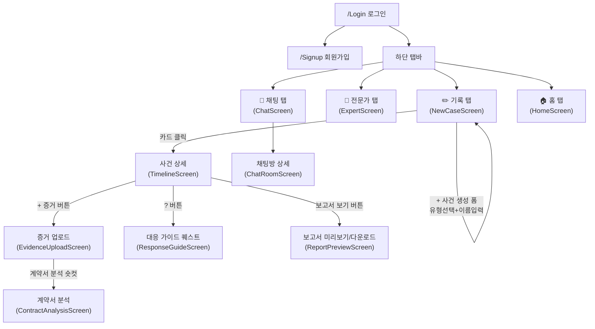

# Themis 기획서 · 화면설계서 · 기능명세서

> 작성 기준일: 2026-08-14 (soh2 브랜치, `origin/gyeom` 병합 직후 실제 코드 기준 + 팀 발표자료 비전 반영)
> 이 문서는 **팀 발표자료(기획 배경/문제정의/페르소나)** + **실제 구현된 코드**(`src/navigation`, `src/screens`, `src/services`)를 함께 근거로 작성했습니다.
> 각 기능·화면에는 상태 표시를 붙였습니다: **✅ 구현됨** / **🔄 부분구현** / **⬜ 계획됨(N월 예정)**
> 네비게이션 흐름은 8/10 채팅에서 팀이 합의한 **"사건 카드 목록 → 사건 상세" 방식**을 기준으로 정리했습니다.
> 구성: **PART 0 서비스 기획서** → **PART 1 화면설계서(IA)** → **PART 2 기능명세서** → **PART 3 발견된 문제/데이터구조/우선순위/로드맵**

---

## PART 0 — 서비스 기획서

### 0-A. 기획 배경 (시행착오)

원래는 GPS + 타임스탬프 기반 레이어드 로그 기능을 가진 여행 앱 **"루티(Routee)"**를 개발하고 있었습니다. 개발 도중 세 가지 문제에 부딪혔습니다.

1. **국내 1위 여행 앱 트리플과 기능이 대부분 겹침** — 일정 자동생성/장소저장/기록공유/커뮤니티까지 차별점을 설명하기 어려웠음
2. **사회적 의미가 부족함** — "이 앱이 사회에 어떤 도움이 될까?"라는 질문에 답이 궁했음. 반면 전세사기·직장내괴롭힘·프리랜서 계약분쟁처럼 법을 몰라 억울하게 당하는 문제는 실제 사회 이슈로 눈에 들어옴
3. **여행 앱에 SOS 기능을 얹으니 정체성이 두 갈래로 갈라짐** — 여행 중 위험상황 시 법적 증거기록+영사관 연결까지 넣어보려 했으나, 여행 앱인지 법률 앱인지 불분명해지고 개발 부담만 커짐

그래서 **"여행"을 "법률"로 치환**하기로 결정했습니다. 루티의 기능이 거의 1:1로 대응됩니다.

| 루티 기능 (여행 앱) | Themis 기능 (법률 안전망) |
|---|---|
| 레이어드 로그(GPS+타임스탬프 자동기록) | 피해 증거 기록(GPS+타임스탬프+사진) |
| 퀘스트 카드(여행 체크리스트) | 법적 대응 단계 체크리스트 |
| 채널 기능(여행 정보 공유) | 전문가·피해자 연결 채널 |
| — (없음) | 계약서 분석기(신규 추가) |

### 0-B. 문제 정의

| 문제 | 현황 |
|---|---|
| 직장 내 괴롭힘 | 연간 신고 1만 1천 건 · 5년 새 5배 증가 |
| 중고거래 사기 | 연간 10만 건 돌파 · 피해자 81%가 10~30대 |
| 전세사기 | 특별법까지 생겼지만 계약서 독소조항을 몰라서 당하는 사례 여전 |

**공통점**: "미리 기록만 해뒀어도 달랐을 텐데." 카카오톡·녹음·날짜별 일지는 법적 증거로 인정되지만, 대부분의 피해자는 이를 사건이 벌어지기 전에 미리 남겨두지 않습니다.

**국내 법률 접근성의 공백**: 기존 법률 서비스 시장은 "피해 이후 변호사 찾기"에 집중된 사후 서비스뿐이고, 예방·기록 단계를 지원하는 서비스가 없습니다.

### 0-C. 해결 방안

기록하고, 확인하고, 공유하는 기능(루티의 GPS+타임스탬프 자동기록)을 그대로 살려 법률 도메인에 적용 — **예방 → 기록 → 대응 → 연대**, 사건 전부터 전 과정을 커버합니다. (각 축의 세부 기능과 구현 상태는 아래 0-1 참고.)

### 0-D. 타겟 유저 — 페르소나

**김덕새 (23세, 대학생)** — 알바도 하고 학교도 다니는 평범한 대학생이 Themis 하나로 여러 피해를 이겨내는 시나리오. 발표 시연에 이 페르소나를 사용합니다.

| Chapter | 내용 | 사용 기능 |
|---|---|---|
| Ch.1 | 알바 근로계약서 분석 — 입사 전 독소조항 발견 | 예방(계약서 신호등) |
| Ch.2 | 직장 내 괴롭힘 — 폭언·협박 증거 수집 | 기록 |
| Ch.3 | 퇴직금 미지급 — 타임라인 → 소액심판 | 기록 + 대응 |
| Ch.4 | 콘서트 티켓 사기 — 공론화 SOS 발동 | 연대 |
| Ch.5 | 스토킹 협박 — 증거 수집 → 경찰 신고 | 기록 + 대응 |
| Ch.6 | 데드맨 스위치 — 위급 상황 자동 알림 | 예방 |

### 0-E. 차별점 — 기존 서비스와의 비교

기존 앱들은 모두 **사건 발생 이후**에만 존재합니다. Themis는 사건 전(예방·기록)부터 사건 후(대응·연대)까지 전 구간을 커버하는 게 차별점입니다.

```
사건 전 ←————————— 사건 발생 ——————————→ 사건 후
[Themis: 계약서 미리 확인, 증거 미리 수집, 기록 습관화]   |   [로톡/오픈채팅/나홀로소송: 변호사 연결, 정보 공유, 절차 안내]
```

| 서비스 | 특징 | 한계 |
|---|---|---|
| 로톡 | 사후 변호사 연결 | 증거 수집 기능 없음 |
| 카카오 오픈채팅 | 피해자 정보 공유 | 체계 없음, 증거 수집 없음 |
| 법원 나홀로소송 | 소액심판 절차 안내 | 절차 안내만, 증거 수집·연대 없음 |
| **Themis** | **예방 · 기록 · 대응 · 연대** | **사건 전부터 전 과정 커버 — 국내 유일 통합 법률 안전망** |

---

## 0-1. 전체 비전 (발표자료 기준)

Themis는 "사건 전 ← 사건 발생 → 사건 후" 전 구간을 커버하는 게 차별점입니다(로톡·오픈채팅·나홀로소송은 사건 후만 커버). 4대 축:

| 축 | 핵심 아이디어 | 상태 |
|---|---|---|
| ① 예방 | 계약서 신호등 분석, 협상 문구 자동생성, 데드맨 스위치 | 🔄 신호등 일부 구현 · ⬜ 협상문구·데드맨스위치 미착수 |
| ② 기록 | 사진/음성/영상/메모/계약서 업로드, GPS+타임스탬프, 클로바 STT, SHA-256, PDF/HTML 보고서 | ✅ 대부분 구현 (Whisper→클로바로 교체됨, PDF는 HTML로 대체 구현) |
| ③ 대응 | 사건 유형별 퀘스트, 생성형 AI 질의응답 | ✅ 구현됨 (8월 스프린트) |
| ④ 연대 | 유사 피해자 채팅방, 전문가 질문 게시판, 핫게시판·공론화 SOS | ⬜ 화면만 있고 백엔드 미연동 (9월 예정) |

**로드맵과 현재 진행 상황 일치 여부**: 7월(계약서분석)→8월(대응가이드)→9월(연대)→10월(데드맨스위치) 순서가 실제 코드 진행 상황과 정확히 일치합니다. 9월/10월 항목이 코드에 없는 건 방치가 아니라 **아직 로드맵상 차례가 안 된 것**입니다.

**발표자료에 있지만 `package.json`에 아직 없는 기술 스택**: Zustand, TypeScript, Twilio(SMS), react-native-pdf — 계획 단계로 이해하면 됩니다. (`EXPO_PUBLIC_LAW_OC` 키는 이미 `.env`에 있어 국가법령정보 API는 일부 연결된 상태로 보입니다.)

**AI 스택 — 계획 vs 실제**: 원안은 계약서/사진 분석에 Claude Vision, 음성에 Whisper, 퀘스트 질의응답에 Claude API를 쓰기로 했으나, 실제로는 음성은 클로바(CSR)로, 퀘스트 질의응답은 Gemini API(`EXPO_PUBLIC_GEMINI_API_KEY`)로 교체돼 있습니다. 계약서 분석(`ContractAnalysisScreen.jsx`)이 실제로 어떤 모델을 쓰는지는 🔧 확인 필요.

**⚠️ 하드 데드라인**: 2026-08-31까지 학술제(덕성여대 과학기술대학) 신청서 제출.

---

## 0. 왜 이 문서가 필요한가

8/13~14 채팅에서 지연님이 지적한 문제:
- 사건 유형 → 퀘스트 미연결
- AI 질문창 응답 오류 (→ 8/10 소희님이 수정 완료)
- 증거 업로드 화면 안에 "사건 대응 퀘스트" 버튼이 들어가 있어 의도한 흐름이 아닌 것 같음
- 사건을 새로 만들어도 독립 타임라인이 아니라 하나로 계속 쌓임

코드를 실제로 열어보니 **일부는 이미 해결돼 있고, 일부는 진짜 버그**입니다. 아래 "3. 발견된 문제"에 파일·줄 단위로 정리했습니다. 이번 주 희겸님 네비게이션 작업의 체크리스트로 그대로 쓰시면 됩니다.

---

## PART 1 — 화면설계서 (IA)

### 1-1. 확정 네비게이션 흐름



### 1-2. 화면 목록

| 화면 | 파일 | 진입 경로 | 역할 | 상태 |
|---|---|---|---|---|
| 로그인/회원가입 | `screens/auth/LoginScreen.jsx`, `SignupScreen.jsx` | 앱 진입 시 (비로그인) | 인증 | ✅ |
| 기록 탭 (사건 목록) | `screens/NewCaseScreen.jsx` | 하단 탭 "기록" | 내 사건 카드 목록 + 새 사건 생성 폼(유형 4종 + 이름) | ✅ |
| 사건 상세 (타임라인) | `screens/TimelineScreen.jsx` | 사건 카드 탭 | 해당 사건의 증거 타임라인(필터/요약), 증거업로드·대응가이드·보고서로 진입하는 허브 | ✅ |
| 증거 업로드 | `screens/EvidenceUploadScreen.jsx` | 타임라인 "+증거" 플로팅 버튼 | 사진/음성/영상/텍스트 업로드, GPS·타임스탬프 자동 기록 | ✅ |
| 대응 가이드 퀘스트 | `screens/ResponseGuideScreen.jsx` | 타임라인 "?" 플로팅 버튼 | 사건 유형별 체크리스트 + Themis AI 질문창 | ✅ |
| 보고서 미리보기 | `screens/ReportPreviewScreen.jsx` | 타임라인 "보고서 보기" 버튼 | HTML 보고서 인앱 미리보기 + 다운로드 (발표자료의 "PDF"는 HTML로 대체 구현) | ✅ |
| 계약서 분석 | `screens/ContractAnalysisScreen.jsx` | 증거 업로드 화면 숏컷 카드 | 계약서 사진 → 독소조항 자동 탐지(신호등) | 🔄 협상문구 자동생성은 미구현 |
| 상세 기록(텍스트) | `screens/UploadScreen.jsx` | 증거 업로드 화면 "상세 기록" 카드 | 텍스트 직접 입력 기록 | ✅ |
| 전문가 탭 (질문 게시판) | `screens/ExpertScreen.jsx` | 하단 탭 "전문가" | HOT 사건 카드, 일반 게시판 — 발표자료의 "지식인형 Q&A" | 🔄 정적 UI, 백엔드 미연동, PDF첨부 미구현 (9월 예정) |
| 채팅 탭 (연대) | `screens/ChatScreen.jsx` | 하단 탭 "채팅" | 유사 피해자 채팅방 목록 | 🔄 정적 UI, 백엔드 미연동 (9월 예정) |
| 채팅방 상세 | `screens/ChatRoomScreen.jsx` | 채팅 탭에서 방 클릭 | 채팅 + 공론화 SOS 발동 버튼 | 🔄 UI는 있으나 SOS 발동 로직·백엔드 미연동 (9월 예정) |
| 홈 탭 | `screens/HomeScreen.jsx` | 하단 탭 "홈" | 대시보드 | ⬜ **100% 정적 목업 — `firebaseService` import 없음.** "박덕새"(발표자료 페르소나명), "전세보증금 미반환" 사건, 증거 개수, 데드맨스위치 ON, 보호자 "홍길동" 전부 하드코딩. 사건 카드/타임라인 버튼이 `navigation.navigate('EvidenceTimeline')`처럼 caseId 없이 호출돼 실제 사건과 연결 안 됨 |
| 핫게시판(공론화) | — | 전문가 탭 내 | 유사 피해자 10명 이상 사건 자동 등록 | ⬜ 미착수 (9월 예정) |
| 데드맨 스위치 설정 | — | 홈 탭(예정) | 30분 무응답 시 보호자 SMS+GPS 자동 발송, Twilio 연동 | ⬜ 미착수 (10월 예정) |
| 새 기록 시작하기 (자유 태그) | `screens/NewCaseScreen.jsx`로 흡수 | 기록 탭 | 발표자료는 "자유 태그 입력"이나, 현재 구현은 고정 유형 4종 선택 방식 | 🔄 설계와 구현 방식 차이 있음 — 팀 확인 필요 |

> `screens/dashboard/HomeScreen.jsx`, `screens/dashboard/RecordsScreen.jsx`는 네비게이터에 연결돼 있지 않은 **미사용 레거시 파일**로 보입니다 — 실제 라우팅에 안 쓰이는지 한 번 확인하고, 안 쓰면 정리 대상입니다.

### 1-3-A. 화면 간 인터랙션 맵 (버튼 → 목적지)

> "이 버튼 누르면 정확히 어디로 가나"를 실제 `navigation.navigate()` 호출 기준으로 정리한 표입니다. 화면 목록(1-2)이 "어떤 화면이 있는가"라면, 이 표는 "화면들이 서로 어떻게 연결돼 있는가"입니다.

| 화면 | 버튼/요소 | 목적지 | 전달 파라미터 | 비고 |
|---|---|---|---|---|
| NewCaseScreen | "사건 생성하기" | EvidenceUpload | `{caseId, caseType}` | 생성 직후 자동 이동 |
| NewCaseScreen | 사건 카드 클릭 | EvidenceTimeline | `{caseId}` | ✅ 8/10 합의안대로 타임라인으로 이동(4버튼 화면 아님) |
| TimelineScreen | ‹ 뒤로가기 | goBack() 또는 HOME_STACK | - | |
| TimelineScreen | "+ 새 사건" | RecordStart | `{openForm:true}` | |
| TimelineScreen | 빈 상태 "증거 업로드하러 가기" | EvidenceUpload | `{caseId, caseType}` | |
| TimelineScreen | 플로팅 "+증거" | EvidenceUpload | `{caseId, caseType}` | caseId 있을 때만 노출 |
| TimelineScreen | 플로팅 "?" | ResponseGuide | `{caseId, caseType}` | 4버튼 화면이 아니라 대응가이드로 감(의도된 설계) |
| TimelineScreen | "보고서 보기·다운로드" | ReportPreview | `{caseData, records}` | |
| EvidenceUploadScreen | 사진/음성/영상 버튼 | (화면 유지) | - | 업로드 후 Alert만 뜨고 화면 안 넘어감 — 여러 개 연속 업로드 가능 |
| EvidenceUploadScreen | "계약서 분석" 숏컷 | ContractAnalysis | - | |
| EvidenceUploadScreen | "사건 대응 퀘스트" 숏컷 | ResponseGuide | `{caseId, caseType}` | ⚠️ 3-2: TimelineScreen "?"버튼과 중복 진입점, 제거 권고 |
| EvidenceUploadScreen | "상세 기록" 카드 | UploadScreen | - | |
| ResponseGuideScreen | "전문가 채널 연결하기" 버튼 | **없음** | - | ⚠️ `onPress` 자체가 없는 죽은 버튼(더미) — 신규 발견 |
| **HomeScreen(홈 탭)** | 사건 배너/카드/타임라인 버튼 | EvidenceTimeline·EvidenceUpload | **없음(paramless)** | ⚠️ 3-5: 100% 목업이라 실제 caseId 없이 호출됨 |

### 1-3. 화면 상태(빈 상태/로딩/에러) — 이미 구현된 것

| 화면 | 상태 | 처리 |
|---|---|---|
| 기록 탭 | 사건 0개 | "아직 등록된 사건이 없습니다" + "첫 사건 만들기" 버튼 |
| 타임라인 | 로딩 중 | ActivityIndicator |
| 타임라인 | 비로그인 | "로그인 후 확인 가능" 안내 |
| 타임라인 | 조회 실패 | 에러 문구 + "다시 시도" |
| 타임라인 | 증거 0건 | "업로드된 증거가 없습니다" + 업로드 유도 버튼 |
| 대응 가이드 | 사건 로딩 중 | ActivityIndicator |

---

## PART 2 — 기능명세서

### 기능 1: 사건 생성 · 목록

- **파일**: `NewCaseScreen.jsx`
- **동작**: 유형 4종(전세사기/금전사기/괴롭힘/신변위협) 중 하나 선택 + 사건 이름 입력 → `createCase({ userId, caseType, title })` 호출 → `cases` 컬렉션에 `{ userId, caseType, title, questSteps: [] }` 저장 → 생성 직후 해당 사건의 타임라인(`RECORD_ROUTES.EVIDENCE_TIMELINE`)으로 이동
- **목록 조회**: `getCasesByUser(userId)` → 생성일 내림차순 정렬, 화면 포커스마다(`useFocusEffect`) 재조회
- **예외 처리**:
  - 이름/유형 미입력 → Alert로 안내, 진행 차단
  - 비로그인 → Alert 후 차단
  - 생성 실패 → `console.error` + Alert "사건 생성에 실패했습니다"
- **우선순위**: P0

### 기능 2: 사건 상세 · 증거 타임라인

- **파일**: `TimelineScreen.jsx`
- **동작**: `caseId` 파라미터 기준으로 `getEvidenceRecords(userId, caseId)` + `getCaseById(caseId)`를 병렬 조회. 유형별(사진/음성/영상/메모/계약분석) 필터 칩 제공, 증거 유형별 개수 요약 배지 표시
- **독립 타임라인 보장 조건**: `caseId`가 정확히 전달돼야 함 — 전달 안 되면 `EvidenceUploadScreen`의 `handleUpload`가 `caseId ?? 'general'`로 폴백해 **모든 사건이 'general'로 뭉쳐 저장**됨 (아래 3-3 참고)
- **계약서 분석 항목**: 카드 탭 시 펼쳐져서 원본 이미지 + AI 분석 결과(위험도별 색상 배지) 표시
- **하단 액션**: 플로팅 "+증거"(caseId 있을 때만 노출) → 증거업로드, 플로팅 "?" → 대응가이드, "보고서 보기" 버튼 → 보고서 미리보기
- **예외 처리**: 로딩/에러/빈 상태 각각 별도 UI (위 1-3 표 참고)
- **우선순위**: P0

### 기능 3: 증거 업로드 (사진/음성/영상)

- **파일**: `EvidenceUploadScreen.jsx`, `services/clovaSpeechService.js`, `services/firebaseService.js`
- **동작**:
  1. `DocumentPicker.getDocumentAsync`로 파일 선택
  2. GPS 위치 권한 요청 후 좌표 기록 (`expo-location`)
  3. 음성(`audio`)인 경우 `transcribeAudioClova(file.uri, file.mimeType)` 호출해 텍스트 변환 → 실패해도 업로드는 진행(음성 텍스트만 비게 됨)
  4. `createEvidenceRecord({ userId, caseId, title, evidenceType, note, file, location })` 호출로 `evidence` 컬렉션 + Storage 업로드
- **클로바 STT 세부**: 60초 단위로 파일을 잘라 순서대로 전송 후 텍스트 이어붙임. `EXPO_PUBLIC_CLOVA_CLIENT_ID/SECRET` 필요 (미설정 시 "클로바 API 키가 설정되지 않았습니다" 에러)
- **알려진 제약**: m4a/AAC 등 압축 포맷은 60초 넘는 조각에서 컨테이너 헤더가 깨져 인식 실패할 수 있음 — 실기기 테스트 필요
- **예외 처리**: 업로드 취소 시 상태 초기화, 업로드 실패 시 Alert, 중복 클릭 방지(`uploadingType` 상태로 버튼 비활성화)
- **우선순위**: P0

### 기능 4: 대응 가이드 퀘스트

- **파일**: `ResponseGuideScreen.jsx`, `services/responseGuideSteps.js`, `services/caseAssistantService.js`
- **동작**:
  - `caseId`가 있으면(퀘스트 모드) `getCaseById(caseId)`로 `caseType`, 저장된 `questSteps`를 가져와 `buildQuestSteps(caseType, savedSteps)`로 화면용 리스트 생성
  - 유형별 고정 퀘스트는 `RESPONSE_STEPS`에 정의(전세사기 6단계, 금전사기 6단계, 괴롭힘 7단계, 신변위협 6단계) — 각 단계에 필요서류/소요기간/링크/전화번호 포함
  - 카드 탭 → 펼치기, 체크박스 → 완료 토글(`toggleQuestStepCompleted`) → `saveCaseQuestSteps(caseId, items)`로 즉시 저장
  - 카드 안 메모 입력 → `onBlur` 시 `saveCaseQuestSteps` 저장
  - 사용자 항목 추가/삭제(`addUserQuestStep`/`removeUserQuestStep`) — AI 고정 항목은 삭제 불가(`source: 'ai'`)
  - 하단 "Themis AI" 질문창 → `askCaseAssistant({ caseType, questStep, question })` 호출, 답변은 `aiHistory` 배열에 누적돼 `saveCaseAiHistory(caseId, history)`로 저장. 답변 하단에 "법률 정보이며 조언 아님" 면책 문구 고정 노출
  - 계약서 체크리스트 모드(`record` 파라미터로 진입, caseId 없음)는 별도 로직(`requiredClauseChecklist.js`) — 사건 개념이 없어 AI 히스토리는 저장하지 않음
- **예외 처리**: AI 호출 실패 시 "오류가 발생했습니다. 다시 시도해주세요." 표시
- **우선순위**: P0 (퀘스트 표시/체크), P1 (AI 질문창)

### 기능 5: 보고서 미리보기 · 다운로드

- **파일**: `ReportPreviewScreen.jsx`, `services/reportHtml.js`
- **동작**: `buildCaseReportHtml({ caseData, records, questItems })`로 사건 정보+증거 목록+퀘스트 진행상황을 HTML 문서로 조립 → 인앱 WebView로 미리보기 → 다운로드 버튼으로 기기에 파일 저장
- **우선순위**: P1

### 기능 6: 계약서 분석

- **파일**: `ContractAnalysisScreen.jsx`, `services/requiredClauseChecklist.js`
- **동작**: 계약서 사진 업로드(`expo-image-picker`) → AI 분석 → `buildChecklist`/`buildChecklistFromText`로 조항별 체크리스트 생성(전월세 등 계약 유형별 `REQUIRED_CLAUSES` 기준) → `createEvidenceRecord`로 `evidenceType: 'contract'` 증거로 저장
- **🔧 미구현**: 분석 결과를 `contracts`/`contract_clauses` 컬렉션에 저장하는 `createContract`/`addContractClause`(firebaseService.js에 이미 존재)는 이 화면에서 호출되지 않음 — "내 계약서 분석 기록" 조회가 불가능한 상태
- **우선순위**: P1 (분석 자체는 완료), P2 (기록 저장/조회는 미구현)

### 기능 7: 전문가 탭 / 채팅 탭 (연대 — 9월 예정)

- **파일**: `ExpertScreen.jsx`, `ChatScreen.jsx`, `ChatRoomScreen.jsx`
- **현재 상태**: 완전히 정적 UI(하드코딩 데이터), `firebaseService` import 없음 — 로드맵상 9월 착수 예정이라 자연스러운 상태
- **🔧 미구현**: `addCommunityComment`, `getCommunityCommentsByPost`, `createChatroom`, `getChatroomsByOriginPost`, `addChatroomMember`, `getChatroomMembers` — firebaseService.js에 이미 정의돼 있으나 어디서도 호출되지 않음
- **우선순위**: P2 (로드맵 9월)

### 기능 8: 핫게시판 · 공론화 SOS (연대 — 9월 예정, ⬜ 미착수)

- **동작 (발표자료 기준)**: 유사 피해자 10명 이상 모이면 해당 사건을 "지금 주목받는 사건" 게시판에 자동 등록. 채팅방 안에서 "공론화 SOS" 버튼으로 발동
- **필요 작업**: 사건 유사도 판단 기준 정의(같은 caseType? 유사 키워드?), 참여자 수 카운트 로직, 게시판 화면·데이터 모델 신규 설계
- **우선순위**: P3 (로드맵 9월, 설계 자체가 아직 안 됨)

### 기능 9: 지식인형 Q&A + PDF 첨부 질문 (연대 — 9월 예정, ⬜ 미착수)

- **동작 (발표자료 기준)**: 전문가 탭 게시판에서 사용자가 PDF(계약서 등) 첨부해 질문 등록, 전문가가 답변
- **관계**: 현재 `ExpertScreen.jsx`의 "일반 게시판" UI가 이 기능의 뼈대로 보이나 PDF 첨부·전문가 답변 흐름은 없음
- **우선순위**: P3 (로드맵 9월)

### 기능 10: 협상 문구 자동생성 (예방 — 시기 미정, ⬜ 미착수)

- **동작 (발표자료 기준)**: 계약서 분석에서 위험 조항 발견 시 "이렇게 바꿔달라고 하세요" 형태의 협상 문구를 AI가 자동 생성
- **관계**: `ContractAnalysisScreen.jsx`의 위험 조항 탐지(신호등)까지는 구현됨, 문구 생성은 별도 AI 호출 추가 필요
- **우선순위**: P2 (7월 계약서분석 항목의 나머지 절반)

### 기능 11: 데드맨 스위치 (예방 — 10월 예정, ⬜ 미착수)

- **동작 (발표자료 기준)**: 사용자가 켜두면 30분간 앱/기기 무응답 시 등록된 보호자에게 자동 SMS(Twilio) + 마지막 GPS 위치 + 증거 공유 링크 발송
- **필요 작업**: 백그라운드 무응답 감지(포그라운드 서비스 또는 주기적 하트비트), 보호자 연락처 등록 UI, Twilio 연동, 위치 공유 링크 생성
- **우선순위**: P3 (로드맵 10월, 코드 전무 — 기술 검증부터 필요. 특히 RN 백그라운드 타이머 정확도는 별도 조사 권장)

---

## PART 3 — 발견된 문제 · 데이터구조 · 우선순위 · 로드맵

### 3. 발견된 문제 (실제 코드 근거)

### 3-1. 라우트 중복 등록

`src/navigation/AppNavigator.jsx`에서 `EvidenceUpload`(97줄/176줄), `EvidenceTimeline`(102줄/177줄), `RecordStart`(92줄/178줄)가 **RecordsNavigator 스택 안**과 **RootStack 최상위**에 각각 중복 등록돼 있습니다. 어느 경로로 진입했느냐에 따라 네비게이션 컨텍스트(파라미터 전달, 뒤로가기 스택)가 달라질 수 있습니다.

**조치**: 최상위 RootStack 쪽 중복 등록(174~179줄)을 제거하고, RecordsNavigator 스택 하나로 통일 추천.

### 3-2. 증거 업로드 화면에 남은 구식 진입점

`EvidenceUploadScreen.jsx`의 "사건 대응 퀘스트" 숏컷 카드(128~153줄)가 `TimelineScreen`의 "?" 플로팅 버튼과 같은 목적지(`ResponseGuideScreen`)로 중복 연결되어 있습니다. 지연님이 지적한 "증거 업로드 화면 안에 퀘스트 버튼이 들어가 있다"는 문제가 정확히 이 부분입니다.

**조치**: 확정된 흐름(타임라인이 허브)대로라면 이 숏컷은 제거하거나, 최소한 "계약서 분석" 숏컷만 남기는 게 흐름과 일치합니다.

### 3-3. 독립 타임라인이 깨질 수 있는 폴백 로직

`EvidenceUploadScreen.jsx`의 `handleUpload`에서 `caseId: caseId ?? 'general'`로 처리합니다. `EvidenceUpload` 화면에 `caseId` 파라미터 없이 진입하는 경로가 하나라도 있으면(예: 3-1의 중복 라우트로 인한 파라미터 유실), 그 증거는 실제 사건이 아니라 `'general'`이라는 고정 caseId로 저장되어 **모든 사건이 하나의 타임라인으로 뭉쳐 보이는** 현상이 재현됩니다. 지연님이 8/13에 겪은 문제와 일치하는 원인 후보입니다.

**조치**: `caseId`가 없는 상태로 `EvidenceUploadScreen`에 진입하는 것 자체를 막거나(진입 전 사건 필수 선택), 최소한 `'general'` 폴백이 실제로 어디서 트리거되는지 로그를 남겨 확인 필요.

### 3-4. 전문가/채팅 화면 백엔드 미연동

3건 모두(`ExpertScreen`, `ChatScreen`, `ChatRoomScreen`) 정적 데이터 — 위 2-기능7 참고. **버그가 아니라 로드맵상 9월(연대) 담당 영역이 아직 순서가 안 온 것**입니다. 다만 8월 안에 여유가 생기면 미리 시작해도 다른 팀원 작업과 겹치지 않는 독립 영역입니다.

### 3-5. 홈 탭이 100% 정적 목업 + caseId 없는 네비게이션 (2026-08-14 발견)

`HomeScreen.jsx`는 `firebaseService`를 아예 import하지 않는 순수 정적 화면입니다. "박덕새"(페르소나명), "전세보증금 미반환" 사건, 증거 개수(사진4·음성2·영상1·PDF1), 퀘스트 체크리스트, 데드맨 스위치 "ON", 보호자 "홍길동" 전부 하드코딩이라 실제 로그인한 사용자와 무관하게 항상 같은 내용이 뜹니다.

추가로 이 화면의 버튼들이 `navigation.navigate('EvidenceTimeline')` / `navigation.navigate('EvidenceUpload')` / `navigation.navigate('RecordStart')`처럼 **문자열 라우트명을 직접 쓰고 caseId 파라미터를 안 넘깁니다.** 이 호출들은 `RecordsNavigator`(기록 탭) 안이 아니라 `HomeStack`(홈 탭) 안에서 실행되므로, React Navigation이 이름을 찾다가 결국 `AppNavigator.jsx`의 **루트(RootStack) 레벨에 중복 등록된 동명 라우트**(3-1 참고)로 연결됩니다 — 즉 3-1의 라우트 중복이 "우연히 작동하게" 만들어주는 임시방편 역할을 하고 있어서, 3-1을 먼저 정리하면 이 버튼들이 완전히 끊깁니다.

**조치 (택 1, 팀 결정 필요)**:
- (a) 홈 탭을 실제 Firestore 데이터(`getCasesByUser`)로 재구성 — 사건 카드 탭 시 해당 사건의 진짜 `caseId`를 `navigation.navigate(APP_ROUTES.RECORDS_STACK, { screen: RECORD_ROUTES.EVIDENCE_TIMELINE, params: { caseId } })` 형태(탭 간 중첩 네비게이션)로 전달하도록 수정
- (b) 당장은 홈 탭 사건 카드/타임라인 단축 버튼을 비활성화하거나 안내 문구로 대체하고, 9월 이후 실제 데이터 연동 시 (a)로 교체
- 3-1(라우트 중복 제거)은 이 화면을 먼저 고친 뒤에 진행해야 홈 탭 버튼이 안 끊깁니다 — **순서: 3-5 먼저 → 3-1**

---

## 4. Firestore 데이터 구조 (실제 사용 중인 컬렉션)

| 컬렉션 | 주요 필드 | 관련 함수 |
|---|---|---|
| `users/{uid}` | 프로필 | `addUserProfile`, `getUserProfile`, `updateUserProfile` |
| `cases` | `userId`, `caseType`, `title`, `questSteps[]`, `aiHistory[]` | `createCase`, `getCasesByUser`, `getCaseById`, `saveCaseQuestSteps`, `saveCaseAiHistory` |
| `evidence` | `userId`, `caseId`, `title`, `evidenceType`, `note`, `location`, `capturedAt`, (contract 시 `analysisItems`) | `createEvidenceRecord`, `getEvidenceRecords` |
| `contracts` 🔧미사용 | - | `createContract`, `getContractsByUser`, `addContractClause`, `getContractClauses` |
| `communityComments` 🔧미사용 | - | `addCommunityComment`, `getCommunityCommentsByPost` |
| `chatrooms` 🔧미사용 | - | `createChatroom`, `getChatroomsByOriginPost`, `addChatroomMember`, `getChatroomMembers` |

---

## 5. 우선순위 정리

| 우선순위 | 항목 |
|---|---|
| **P0 (필수, 대부분 구현 완료)** | 로그인/회원가입, 사건 생성/목록, 사건별 타임라인, 증거 업로드(사진/음성/영상), 대응 퀘스트 체크리스트 |
| **P1 (구현 완료, 안정화 필요)** | 클로바 음성 변환(실기기 테스트 남음), AI 질문창, 보고서 미리보기/다운로드, 계약서 분석(신호등) |
| **P2 (다음 단계, 8월 내 가능)** | 라우트 중복 정리(3-1), 구식 진입점 제거(3-2), 독립 타임라인 폴백 버그 수정(3-3), 계약서 분석 결과 저장/조회, 전문가·채팅 백엔드 연동, 협상 문구 자동생성 |
| **P3 (로드맵 9~10월, 설계부터 필요)** | 핫게시판·공론화 SOS, 지식인형 Q&A(PDF첨부), 데드맨 스위치(Twilio) |

## 6. 로드맵

> ⚠️ **8/31 — 학술제 신청서 제출 마감** (덕성여대 과학기술대학 학술제). 아래 8월 계획의 마지막 주차 항목입니다 — 놓치면 안 되는 하드 데드라인입니다.

### 6-1. 최신 로드맵 (업데이트본 — 실제 진행과 일치, 이게 현재 유효 버전)

| 기간 | 내용 | 현재 상태 |
|---|---|---|
| ~7월 | 기초 세팅 + 기록 기능(타임라인/업로드) + 계약서 분석(신호등) | ✅ 완료 |
| 8/11~8/17 | 네비게이션 전체 수정(사건별 독립 타임라인), 클로바 음성인식 교체, OCR 기능 추가 | 🔄 진행 중 (이번 주 스프린트, 3-1~3-3 버그가 이 작업 범위) |
| 8/18~8/24 | HTML→PDF 변환 완성, 사건 보고서 미리보기+다운로드, 무결성 강화(서버 타임스탬프·워터마크·영상 5초 스탬프) | ⬜ 예정 (HTML 보고서는 이미 있음, PDF 변환·워터마크가 남은 작업) |
| 8/25~8/31 | 데드맨 스위치(Cloud Functions), 서명 시스템, 전체 테스트, **학술제 신청서 제출(8/31 마감)** | ⬜ 예정 |
| 9월 | Firebase 채팅방 실연동, 전문가 채널, 유사 피해자 매칭, **디자인 리디자인**(Monday 앱 참고, 각지고 미니멀하게), **부동산 API 연동**(등기부등본·실거래가), 공론화 SOS, 법령 API 판례 매칭 | ⬜ 미착수 |
| 10월 | 4단계 전체 흐름 통합 테스트, 버그 수정, UI 일관성, 실제 시나리오 테스트 | ⬜ 미착수 |
| 11월 | 발표(시연 시나리오, 리허설) | ⬜ 미착수 |

### 6-2. 팀 역할 분담 (영역별)

| 영역 | 팀원 A | 팀원 B | 팀원 C |
|---|---|---|---|
| 프론트 | 예방 화면(계약서 분석) | 기록 화면(타임라인) | 대응+연대 화면 |
| 백엔드 | Firebase DB 구조 + 인증 | GPS + SHA-256 + Storage | PDF + Cloud Functions + 채팅 |
| AI 연동(계획) | Claude Vision(계약서) | Whisper + Claude Vision(로그) | Claude API(퀘스트) |
| AI 연동(실제) | 🔧 확인 필요 | 클로바 STT(Whisper 대체) | Gemini API(퀘스트) — 계획과 다름 |

> 실명(소희/지연/희겸)과 A/B/C 매핑은 원자료에 없어 임의로 연결하지 않았습니다. 필요하면 팀 확인 후 채워 넣으세요.

### 6-3. 원본 초안 로드맵 (5~11월, 8월 이후는 위 6-1로 대체됨 — 참고용)

| 월 | 핵심 목표 | 완료 기준 |
|---|---|---|
| 5월 | 기초 세팅 (환경·DB스키마·공통화면) | 앱 켜지고 화면 이동됨 |
| 6월 (1학기 발표) | 기록 기능 — 타임라인, Whisper, Claude Vision | 음성→텍스트, 사진→분석 됨 |
| 7월 | 예방 기능 — 계약서 분석, 신호등 UI | 계약서 찍으면 위험도 나옴 |
| ~~8월~~ | ~~AI 퀘스트, PDF, 데드맨 스위치 한 달치~~ | → **6-1의 8월 계획으로 대체됨** |
| ~~9월~~ | ~~연대 기능(채팅방·매칭·공론화)~~ | → **6-1의 9월 계획(디자인 리디자인·부동산API 추가됨)으로 대체됨** |
| 10월 | 통합 + 보완 | 처음부터 끝까지 막힘없이 |
| 11월 | 발표 준비 | 발표장 시연 가능 |

---

## 다음 액션

1. **희겸님**: 3-1(라우트 중복), 3-2(구식 숏컷), 3-3(caseId 폴백)를 이번 주 네비게이션 작업 체크리스트로 사용
2. **지연님**: 위 흐름(1-1)이 실제로 원하시던 방향이 맞는지 확인 — 다르면 이 문서를 기준으로 팀 채팅에서 바로 논의. 발표자료의 "새 기록 시작하기 — 자유 태그 입력"과 현재 구현(고정 유형 4종 선택)이 다른데, 어느 쪽이 최신 결정인지 팀 확인 필요
3. **소희님**: 클로바 실기기 테스트 완료 후, 여유 되면 P2의 "전문가·채팅 백엔드 연동", "계약서 분석 결과 저장", "협상 문구 자동생성" 담당 가능 (다른 두 분 작업 파일과 안 겹침)
4. **팀 전체**: P3(핫게시판/SOS, 데드맨 스위치)는 9~10월 전까지는 설계도 안 돼 있는 상태이므로, 8월 안에 한 번은 셋이 모여 데이터 모델·화면 흐름을 구체화하는 세션이 필요해 보입니다
